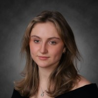

## About Me

 
My name is Lauren Willson, and I am a sophomore Biomedical Engineering Student at Cornell University. Outside of my BME classes, I'm involved in a lot of student groups on campus include the SensTech project team, Cornell EMS, and club tennis. When I'm not studying or sneaking in a gym session or two, I enjoy scoping out all the niche cafes on campus just to order the same caramel skim milk latte and performatively walking around with my wired earphones in.

Take a look at my projects and CV .

